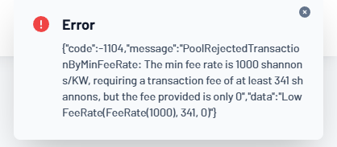
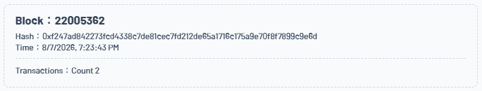

# Builder Track Weekly Report — Week 1

**Name:** Wildan Rahman
**Week Ending:** August 9, 2026

### Courses Completed

- **CKBuilder onboarding** — OffCKB [quick start](https://docs.nervos.org/docs/getting-started/quick-start): local devnet + first contract deployment
- **Nervos docs:** [Introduction to Nervos CKB](https://docs.nervos.org/docs/ckb-fundamentals/nervos-blockchain), [How CKB Works](https://docs.nervos.org/docs/getting-started/how-ckb-works), [Introduction to Script](https://docs.nervos.org/docs/script/intro-to-script)
- **CKB Academy:** [Basic Operation course](https://academy.ckb.dev/courses/basic-operation) (lessons 1–2), finishing with a manually constructed transfer transaction on testnet

### Key Learnings

- **Layered architecture** — CKB is the Layer 1 "Common Knowledge Base" providing security and trust for layers above; consensus is PoW (NC-Max).
- **CKByte doubles as storage rights** — 1 CKB = 1 byte of on-chain space; a cell must always hold at least its own occupied size in capacity (61 CKB minimum for a standard lock with empty data).
- **Cell model** — a generalized UTXO: cells are immutable containers of arbitrary data. State updates work by *consuming* a live cell as a transaction input (it becomes dead) and creating new output cells with updated data — replace, not mutate.
- **Implicit fees** — there is no gas price field; fee = sum(input capacities) − sum(output capacities).
- **Scripts** — CKB's smart contracts are RISC-V binaries run by CKB-VM, so any language that compiles to RISC-V works (Rust, C, JS). Each cell has a mandatory **lock script** (ownership — runs when the cell is consumed) and optional **type script** (application rules — runs on inputs and outputs).
- **cellDeps vs inputs** — transactions load script code by *referencing* code cells in `cellDeps` without consuming them, which is why one Omnilock code cell serves the whole network.
- **Verify, don't execute** — unlike the EVM, CKB-VM doesn't compute state on-chain; the new state is proposed in the transaction outputs and scripts only validate it.

### Practical Progress

- Deployed the hello-world contract to a local OffCKB devnet and verified the deployment transaction was committed via RPC ([screenshots](assets/week-01/)).
- Manually filled in a raw transfer transaction on CKB Academy (cellDeps for SECP256K1_BLAKE160 + Omnilock, input from my live cell, output, witnesses), generated the tx_hash, signed via wallet, serialized WitnessArgs, and sent it to testnet.
- **Debugging story:** my first send was rejected with `PoolRejectedTransactionByMinFeeRate` — I had set output capacity equal to input capacity, making the implicit fee 0. Fixed by reducing the output by 100,000 shannons, which taught me a second lesson: changing the transaction changes its hash, so the whole sign flow (tx_hash → message → signature → WitnessArgs) had to be redone. I also initially pasted the tx_hash into `witnesses` instead of the serialized WitnessArgs blob.
- Transaction was packaged in testnet block [22005362](https://pudge.explorer.nervos.org/block/22005362).

**Evidence:**

### Environment

- Windows 11 + WSL2 (Ubuntu), Node.js 22 via nvm
- OffCKB 0.4.11, TypeScript contract project (offckb create)
- Wallet connected to CKB testnet (Omnilock)

### Plan for Next Week

- Deepen on how lock/type scripts are written and tested (Rust + ckb-std, CCC playground)
- Start beginner exercises: [Transfer CKB](https://docs.nervos.org/docs/dapp/transfer-ckb) and [Store Data on Cell](https://docs.nervos.org/docs/dapp/store-data-on-cell)
