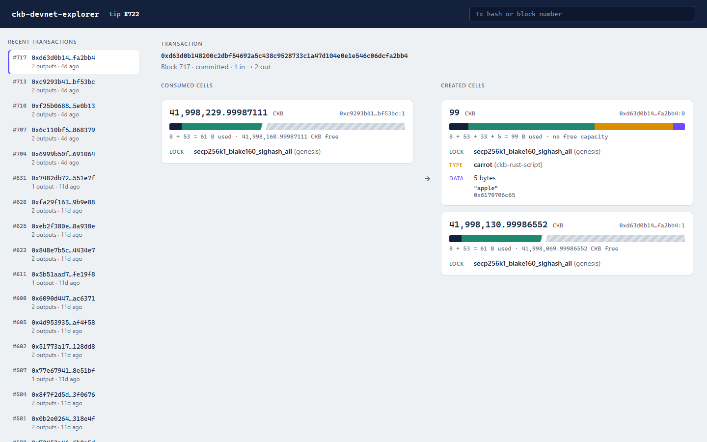
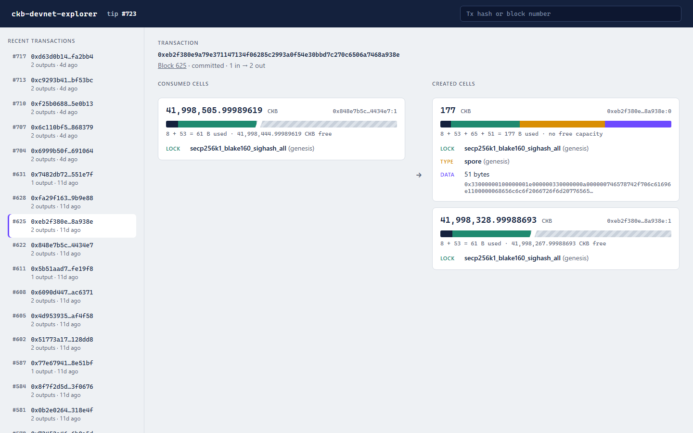

# Builder Track Weekly Report — Week 10

**Name:** Wildan Rahman
**Week Ending:** October 11, 2026

### Courses Completed

- Capstone week 2: a web UI for [ckb-devnet-explorer](https://github.com/wildanrhmn/ckb-devnet-explorer). `npm run serve` starts it at `localhost:7070`.

### Key Learnings

- The RPC doesn't give you the cells a transaction consumed. `get_transaction` only lists inputs as `previous_output` (a tx hash and an index), so to show what was spent the explorer fetches each of those earlier transactions and reads the output at that index. Before this I'd only ever looked at outputs.
- A cellbase transaction (the block reward) is recognizable from its single input pointing at an all-zero tx hash. The explorer skips those in the feed, since most devnet blocks only have that one.
- How many bytes a cell occupies can be worked out from the cell alone: 8 bytes for the capacity field, 33 bytes plus the args for each script, plus the data. My week 8 spore comes out to 8 + 53 + 65 + 51 = 177, the same breakdown I did by hand that week. The carrot cell is 8 + 53 + 33 + 5 = 99, with no free capacity at all. That's because CCC fills in the minimum capacity when you don't set one, which I first noticed back in week 2.
- Change cells are a problem for drawing that to scale. They hold around 42 million CKB against 61 bytes used, so a proportional bar is just one empty bar. When free capacity is more than 3x the used bytes, the bar cuts the free part short and marks the cut with a break.
- Devnet blocks never change once mined, so the server caches them by block number. The exception is `offckb clean`, which restarts the chain from block 0. The cache is dropped whenever the tip number goes down.
- I went with plain HTML and JavaScript served by the same Node process instead of React. There's no build step, so it stays one command to run, and with only system fonts it works with no internet, which suits a local dev tool.

### Practical Progress

- `src/explorer.ts`: the recent transaction feed, the transaction view with inputs resolved, the block view, and the occupied-bytes calculation.
- `src/server.ts`: a small `node:http` server with `/api/info`, `/api/transactions`, `/api/tx/:hash` and `/api/block/:number`, plus the page itself. If the devnet isn't running, it says to start `offckb node` instead of just failing.
- `src/web/`: the page. Recent transactions on the left (they refresh every 4 seconds, and the tip number flashes on a new block), consumed and created cells on the right. Each cell shows its capacity, a link to the transaction that created it, its lock and type by name with "genesis" or the project it comes from, its data (decoded when it's readable text), and the capacity bar. The search box takes a tx hash or a block number.
- Checked against real transactions on my devnet. The carrot tx shows `carrot (ckb-rust-script)` with its data decoded as `"apple"`. The week 8 spore tx shows `spore (genesis)` with 177 bytes used and nothing free.
- Pushed to the repo (commit `d9a1282`), with a screenshot and run instructions in the README.

**Evidence:**

### Environment

- Same as week 9: WSL2 Ubuntu, Node 22, offckb 0.4.11, TypeScript run with `tsx`
- No new runtime dependencies. The server is `node:http`, the page is plain HTML/CSS/JS

### Plan for Next Week

- Label deployed contract cells by hashing their data and matching the code hash, so they stop showing as anonymous `22704 bytes`
- Decode common data formats: xUDT amounts, DAO deposit and withdrawal markers, spore content
