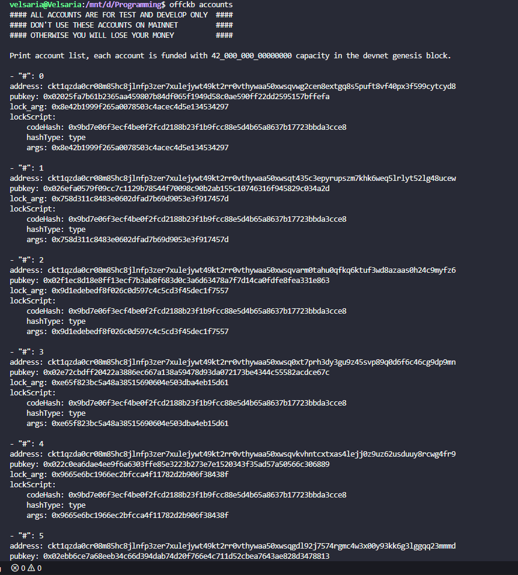
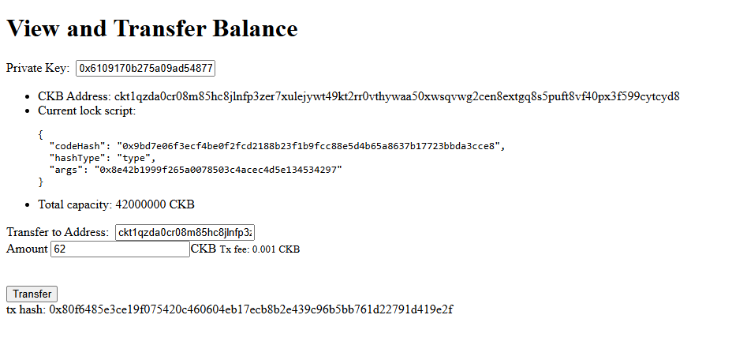
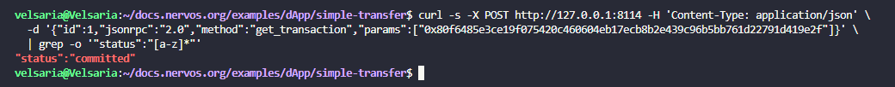
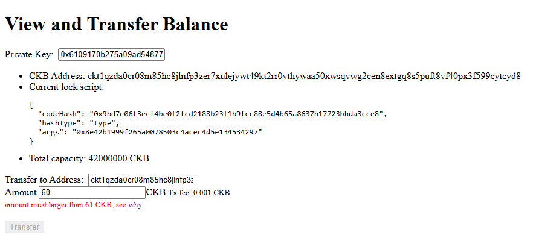
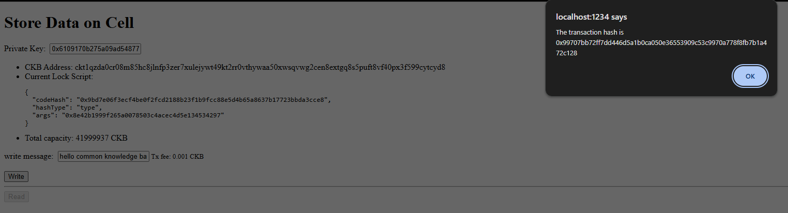
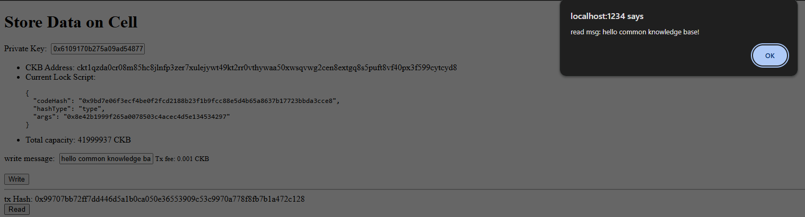
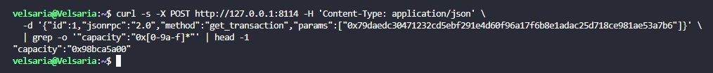
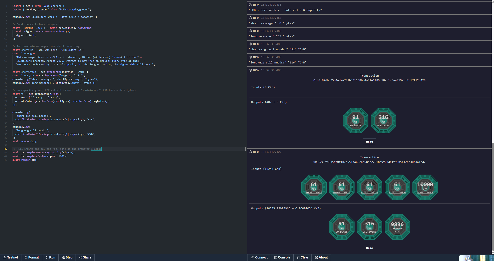

# Builder Track Weekly Report — Week 2

**Name:** Wildan Rahman
**Week Ending:** August 16, 2026

### Courses Completed

- Beginner exercise 1: [Transfer CKB](https://docs.nervos.org/docs/dapp/transfer-ckb) (simple-transfer example, devnet)
- Beginner exercise 2: [Store Data on Cell](https://docs.nervos.org/docs/dapp/store-data-on-cell) (store-data-on-cell example, devnet)
- CCC Playground session: [live.ckbccc.com](https://live.ckbccc.com) — rebuilt the data-storage flow by hand
- Read the source of my week-1 hello-world contract + re-read [Intro to Script](https://docs.nervos.org/docs/script/intro-to-script)

### Key Learnings

- Last week I built a transfer transaction completely by hand on CKB Academy. This week I did the same thing through CCC and it collapses into basically four calls: `ccc.Transaction.from({outputs})`, `completeInputsByCapacity(signer)`, `completeFeeBy(signer, 1000)`, `signer.sendTransaction(tx)`. Cell picking, fee math, tx hashing, signing, witness serialization — all the tedious parts I suffered through manually are handled by the SDK. Funny detail: the `1000` in `completeFeeBy` is the same 1000 shannons/KB fee rate from my week-1 `LowFeeRate` rejection.
- OffCKB devnet accounts are deterministic. The transfer dApp came pre-filled with account #0's private key and account #1's address, and I could match them 1:1 against my own `offckb accounts` output. Every OffCKB devnet generates the same 20 test accounts, which is why tutorials can hardcode them.
- "Balance" on CKB is not a number stored somewhere — the UI literally labels it *total capacity*, because it's just the sum of all live cells my lock script controls.
- Storing data on-chain is the same transaction shape as a transfer. The only difference in the code is `outputsData` carrying the hex-encoded bytes. Data is raw bytes: text goes through `TextEncoder` (UTF-8) to hex, and comes back with `TextDecoder`.
- The 1 CKB = 1 byte rule in practice: a cell's minimum capacity is 61 CKB (its own overhead for a standard lock) + 1 CKB per byte of data. When I stored a longer message the UI looked exactly the same, which threw me off at first — the dApp just silently allocates a bigger cell. I only saw the difference after digging into the transaction itself.
- Byte length ≠ character count. The em dash in my test message costs 3 bytes in UTF-8, not 1.
- Reading my deployed hello-world contract was a bit of an anticlimax in the best way: it's ~15 lines. It pulls its context in via syscalls (`bindings.loadScript()`), does whatever checks it wants, and exits — 0 means the transaction is valid, anything else kills it. No state, no storage API, no calling other contracts. The script can only inspect the proposed transaction and vote yes/no. That's the "verify, don't execute" model made concrete.

### Practical Progress

- Transferred 62 CKB from devnet account #0 to #1 through the simple-transfer dApp — tx `0x80f6485e3ce19f075420c460604eb17ecb8b2e439c96b5bb761d22791d419e2f`, confirmed `committed` via RPC.
- Tried transferring 60 CKB on purpose to see what happens below the 61 CKB minimum — got rejected, since the output cell can't cover its own bytes.
- Stored a message in a cell's data field and read it back through the store-data-on-cell example, then repeated it with a much longer message for comparison.
- In the CCC playground I built one transaction with two data-carrying outputs, short and long message, leaving `capacity` blank so CCC computes each cell's minimum: the 30-byte message needed a 91 CKB cell, the 255-byte one needed 316 CKB. Same transaction, capacities scaling exactly with byte length — the visual render finally shows what the dApp UI was hiding.

**Evidence:**

### Environment

- Same setup as week 1: Windows 11 + WSL2 Ubuntu, Node 22 (nvm), OffCKB 0.4.11 devnet
- Examples from the nervosnetwork/docs.nervos.org repo, run with `NETWORK=devnet npm start`
- CCC playground in-browser against testnet

### Plan for Next Week

- Beginner exercise 3: [Create a Fungible Token](https://docs.nervos.org/docs/dapp/create-token) — first contact with the xUDT standard
- If time allows, start exercise 4: [Create a DOB](https://docs.nervos.org/docs/dapp/create-dob)
- Keep poking at script code on the side — I want to understand what a lock script for a token actually checks
