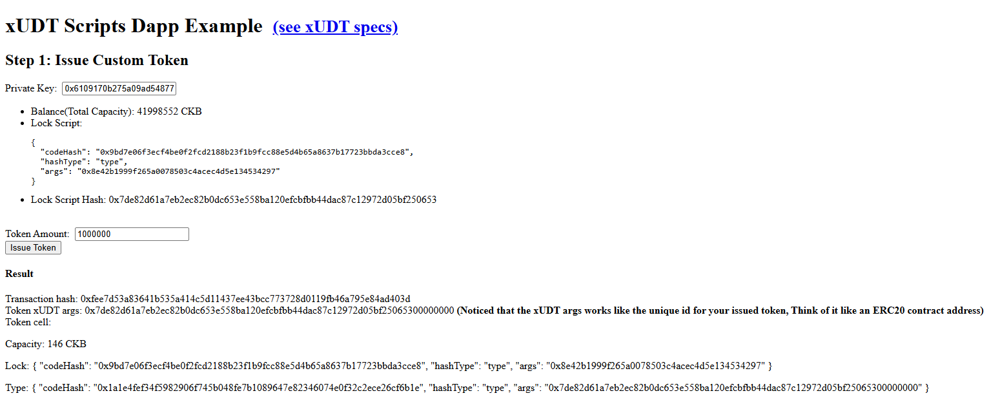
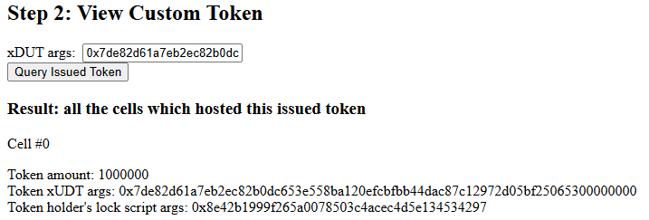
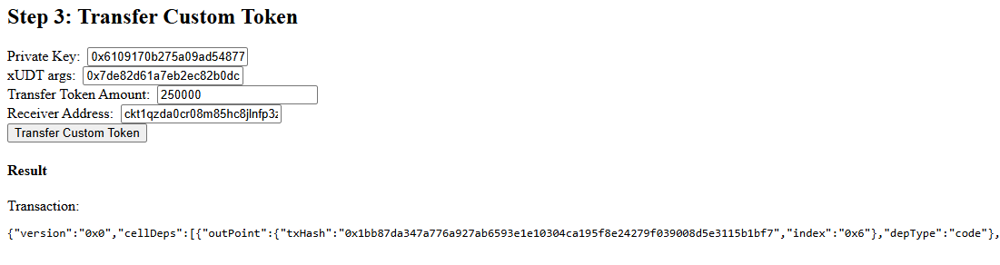
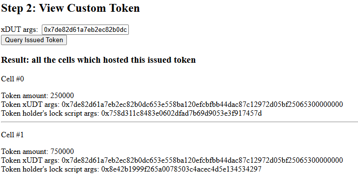
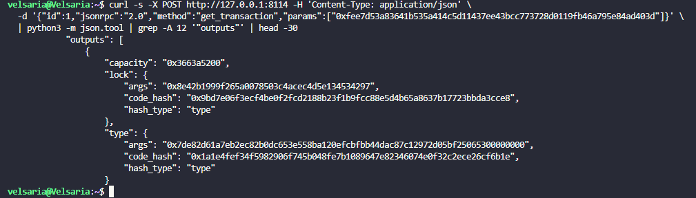
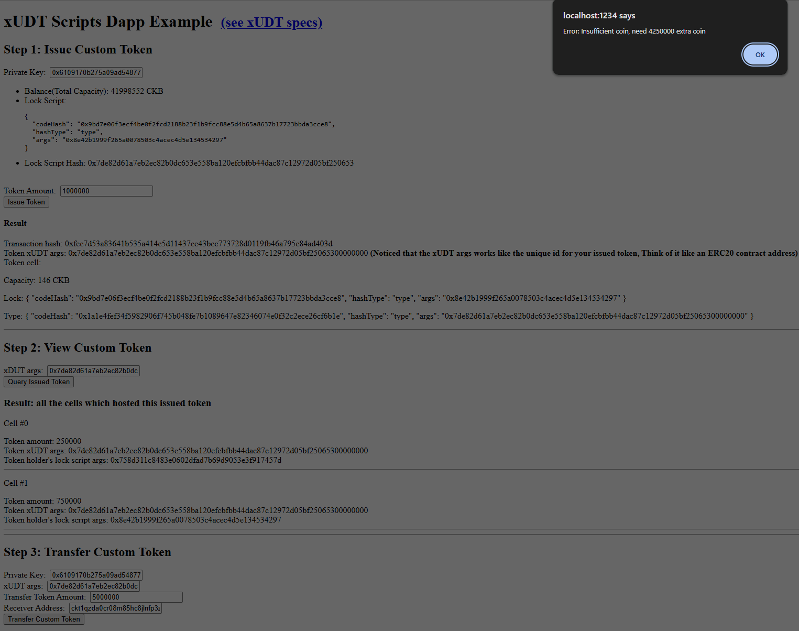
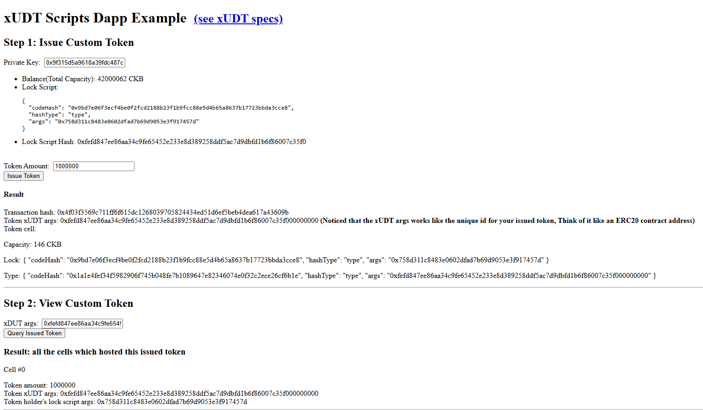
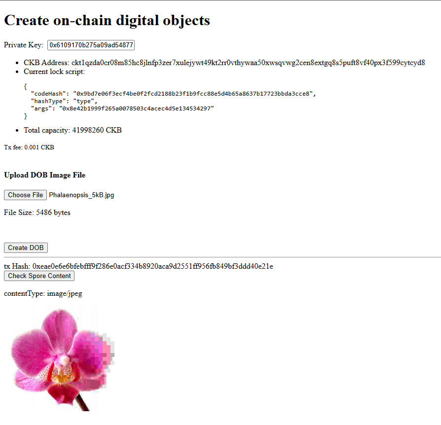

# Builder Track Weekly Report — Week 3

**Name:** Wildan Rahman
**Week Ending:** August 23, 2026

### Courses Completed

- Beginner exercise 3: [Create a Fungible Token](https://docs.nervos.org/docs/dapp/create-token) (xudt example, devnet)
- Beginner exercise 4: [Create a DOB](https://docs.nervos.org/docs/dapp/create-dob) (create-dob example, devnet)
- Read through the xudt example's `lib.ts` to see how issuing, querying and transferring are actually built

### Key Learnings

- A token on CKB is not a contract with a balance mapping. It's a **type script** (xUDT) sitting on cells. Each token cell holds the amount in its data (16 bytes, little-endian) and the cell's lock says who owns it. Same cell model as everything else, just with a type script attached.
- The token's identity is the xUDT script's **args**, which is the issuer's lock script hash plus `00000000`. No contract address anywhere. The dApp literally says "think of it like an ERC20 contract address", which helped.
- This clicked hardest when I issued a second token from account #1: same xUDT code hash, different args, and the query for one token doesn't see the other at all. One script, unlimited tokens, separated only by args.
- "Who holds this token" is not stored anywhere. The dApp answers it with `findCellsByType(typeScript)` — just a cell query. After transferring, the holder list showed two cells: the receiver with 250000 and me with a 750000 change cell. Token transfers produce change cells the same way CKB transfers do, and the code has to add that change output by hand (`balanceDiff` → `addOutput`), otherwise the leftover would just vanish.
- The token cell cost exactly 146 CKB and I could account for every byte: 8 (capacity) + 53 (lock: 32 code hash + 1 hash type + 20 args) + 69 (type: 32 + 1 + 36 args) + 16 (amount data) = 146. The 1 CKB = 1 byte rule applies to the scripts too, not just the data.
- Looking at the raw cell over RPC was the first time I saw a cell with both `lock` and `type` filled in. Lock = who can spend it, type = what rules the data follows.
- A DOB (Spore) is a cell whose data **is** the asset. I uploaded a 5486-byte jpeg and the app rendered it back straight from the cell with `contentType: image/jpeg`. No IPFS, no URL, the bytes are on-chain. By the capacity rule that's ~5.5k CKB locked up in that one cell, which is why Spore lets you melt it later and get the CKB back.

### Practical Progress

- Issued 1,000,000 units of my own xUDT token from devnet account #0 — tx `0xfee7d53a83641b535a414c5d11437ee43bcc773728d0119fb46a795e84ad403d`, token cell 146 CKB.
- Transferred 250,000 to account #1, queried holders and got the expected two cells (250,000 receiver + 750,000 change back to me).
- Pulled the issue tx over RPC to inspect the raw output cell: lock + type scripts, type args = my lock hash + `00000000`.
- Tried to transfer 5,000,000 while only holding 750,000. Got `Insufficient coin, need 4250000 extra coin` — CCC couldn't collect enough token cells for the inputs, so the tx never even reached the chain. If it had, the xUDT type script would have rejected it anyway (outputs > inputs).
- Issued a second, separate token from account #1 (tx `0x4f03f3569c711ff6f615dc1268039705824434ed51d6ef5beb4dea617a43609b`) to confirm the args = identity idea.
- Created a DOB from a small image file — tx `0xeae0e6e6bfebffff9f286e0acf334b8920aca9d2551ff956fb849bf3ddd40e21e`, then fetched and rendered it from the chain.

**Evidence:**

### Environment

- Same as before: Windows 11 + WSL2 Ubuntu, Node 22 (nvm), OffCKB 0.4.11 devnet
- Examples from nervosnetwork/docs.nervos.org (`examples/dApp/xudt`, `examples/dApp/create-dob`), run with `NETWORK=devnet npm start`

### Plan for Next Week

- Beginner exercise 5: [Build a Simple Lock](https://docs.nervos.org/docs/dapp/simple-lock) — first time writing a script instead of just using one
- Start looking at the xUDT script source itself to see how the inputs ≥ outputs check is written
