# Builder Track Weekly Report — Week 4

**Name:** Wildan Rahman
**Week Ending:** August 30, 2026

### Courses Completed

- Beginner exercise 5: [Build a Simple Lock](https://docs.nervos.org/docs/dapp/simple-lock) (simple-lock example: hash lock script in TypeScript on ckb-js-vm, devnet)
- That's all five beginner exercises done.

### Key Learnings

- First week actually writing a lock script instead of using one. The whole thing is ~15 lines: load the script args, load the witness, hash the witness, compare, `return 0` or `return 11`. A lock script really is just a function that gets the transaction as input and says yes or no.
- The script is JavaScript, so it doesn't run on CKB-VM directly. It runs inside **ckb-js-vm**, which is itself a RISC-V binary deployed on chain. That's why the cell's lock has `codeHash = ckb-js-vm`, and *my* script's hash is inside the args. Deploying gave me two OutPoints and every unlock transaction needs two cellDeps (the interpreter + my script).
- The args layout is `0x0000` (2 flag bytes) + my script code hash (32) + hash type (1) + the preimage hash (32). The script skips the first 35 bytes with `.slice(35)` and compares the last 32 against `hashCkb(witness.lock)`. Seeing the bytes on the frontend page next to `.slice(35)` in the code made it obvious.
- Cycles are CKB's gas. The mock test reported **13,086,956 cycles** for one hash comparison, which is the cost of running JS through an interpreter on chain. A native Rust lock would be far cheaper. Good to know before choosing a language for anything real.
- The witness is public. After unlocking I pulled the transaction and the witness was `0x25000000...77696c2d636b6275696c646572732d7734`, which `xxd` decodes straight back to `wil-ckbuilders-w4`. Whoever sees the chain sees the secret, and since the example sends change back to the same hash lock, the leftover cell is now spendable by anyone. The tutorial says as much. Signature-based locks exist for a reason.
- The thing I keep thinking about: with Attestar I did Groth16 in the browser, and CKB-VM has no precompile restrictions. A hash lock where the witness carries a ZK proof of knowing the preimage (instead of the preimage itself) would fix the leak. Not building it now, but noting it as a possible capstone direction.
- `TransactionFailedToResolve` means a cellDep or input OutPoint doesn't exist on this chain. `TransactionFailedToVerify` means the OutPoints resolved and a script actually ran and rejected it. I got both this week, in that order, and the difference matters.

### Practical Progress

- Set up pnpm (hit pnpm 10's build-script guard on first `pnpm build` — `esbuild`, `secp256k1`, `sharp` were blocked until `pnpm approve-builds`).
- Built the hash-lock contract (esbuild bundle → QuickJS bytecode `dist/hash-lock.bc`) and deployed it to devnet: tx `0xef8578782f8add2083becd0fb29d0201e860871620a5514a2c2486493f748acf`, `hashType: data2`, Type ID disabled.
- Ran the test suite: both the mock test (off-chain, ckb-testtool, `Run result: 0`) and the devnet test (two real transactions) pass. The devnet test needed `PRIVATE_KEY` in `.env` — used devnet account #0.
- Built a lock with preimage `wil-ckbuilders-w4`, funded the address with 300 CKB via `offckb deposit`.
- First transfer attempts failed with `TransactionFailedToResolve: Unknown(OutPoint(0x4309def4...))` no matter which preimage I used. Turned out `frontend/deployment/scripts.json` is a separate copy from the root `deployment/scripts.json` and still held the tutorial author's OutPoint. The deploy script didn't sync it. Copied the real deployment files into the frontend folder, restarted, re-funded the (now different) address.
- Wrong preimage → `TransactionFailedToVerify ... Inputs[0].Lock ... error code 11`. My script's `return 11`, coming back through the node.
- Correct preimage → 99 CKB transferred to account #1, tx `0x0a6c64b162a783b6a7f8dbfe09759079bfc0b52f952627a3dce139c52fd4b36e`, committed.
- Pulled the witness from the tx over RPC and decoded the preimage back out of it.

**Evidence:**

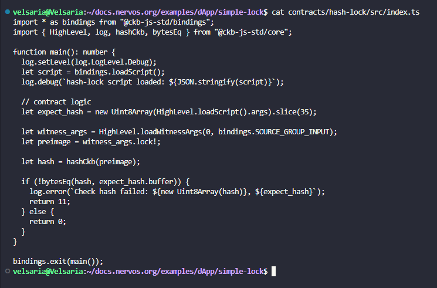
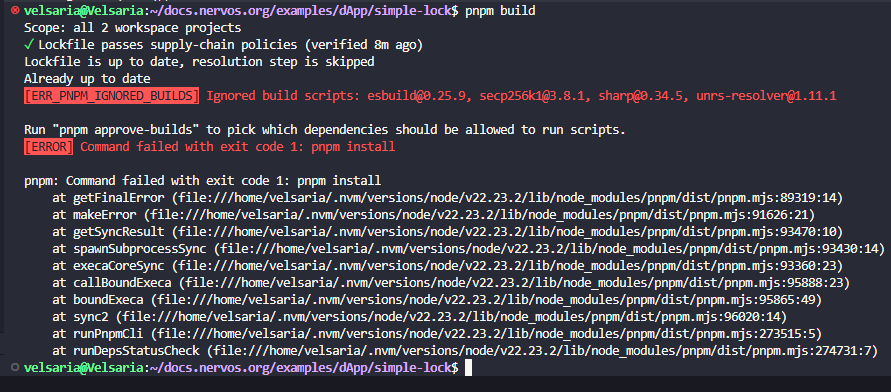
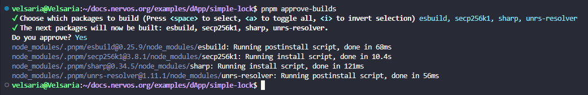
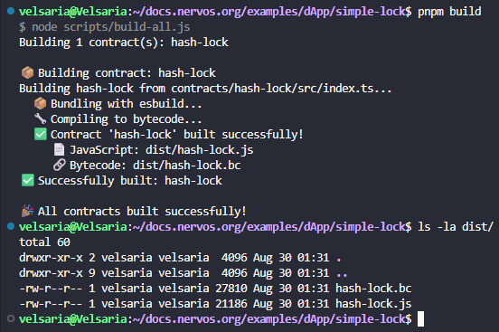
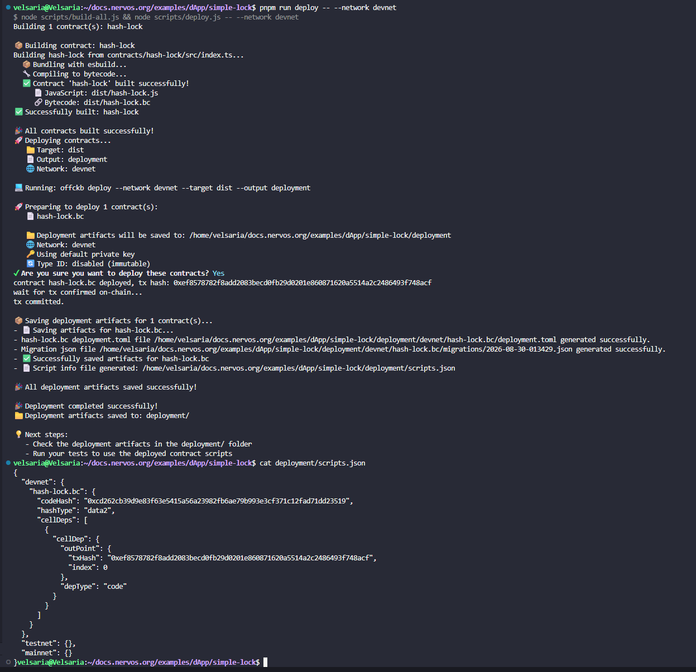
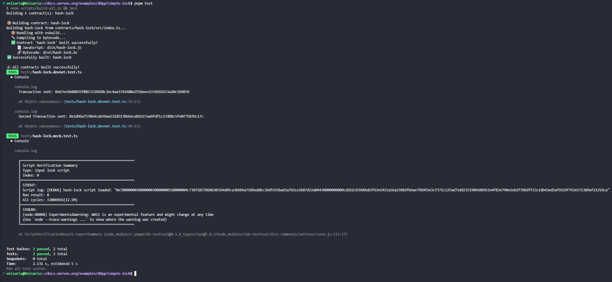
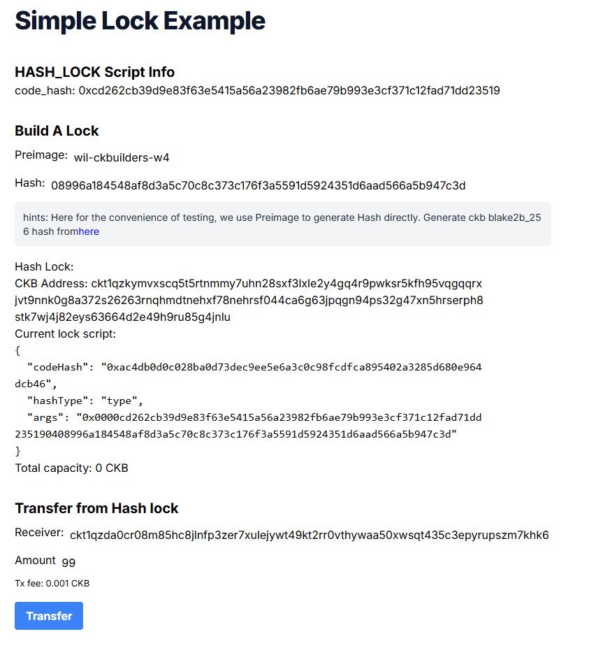
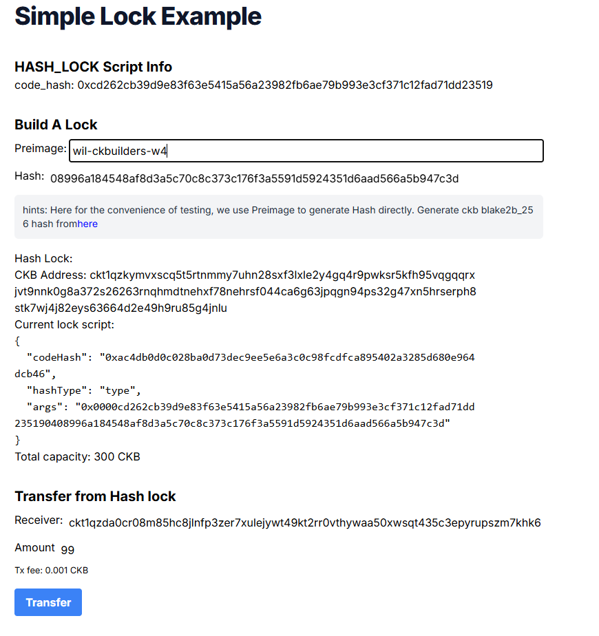
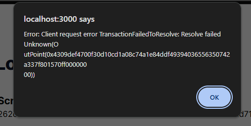
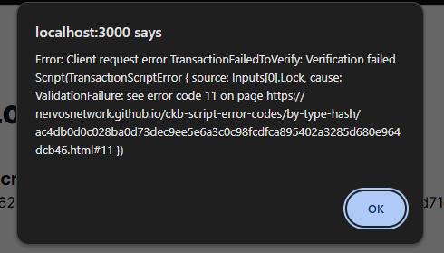
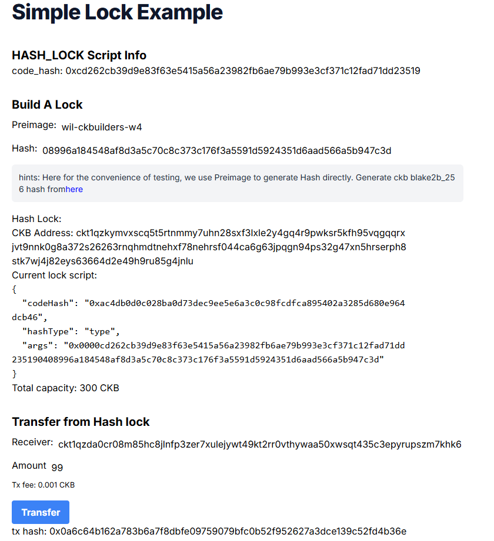
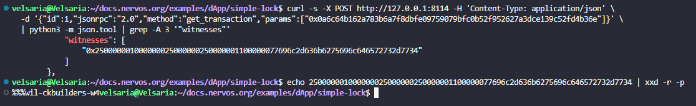

### Environment

- Windows 11 + WSL2 Ubuntu, Node 22 (nvm), pnpm 10, OffCKB 0.4.11 devnet
- `nervosnetwork/docs.nervos.org` `examples/dApp/simple-lock` — contract via ckb-js-vm (`@ckb-js-std`), tests via jest + ckb-testtool, Next.js frontend
- Cursor connected to WSL for reading the code

### Plan for Next Week

- Beginner phase is done. Moving into the intermediate material: the Script development course, starting with the validation model and script basics.
- Look at the xUDT script source properly now that I've written a lock, and compare a Rust script's structure to the JS one.
