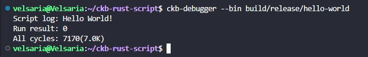
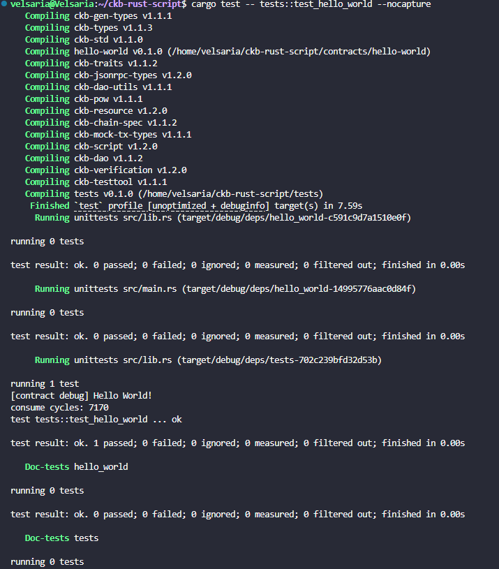
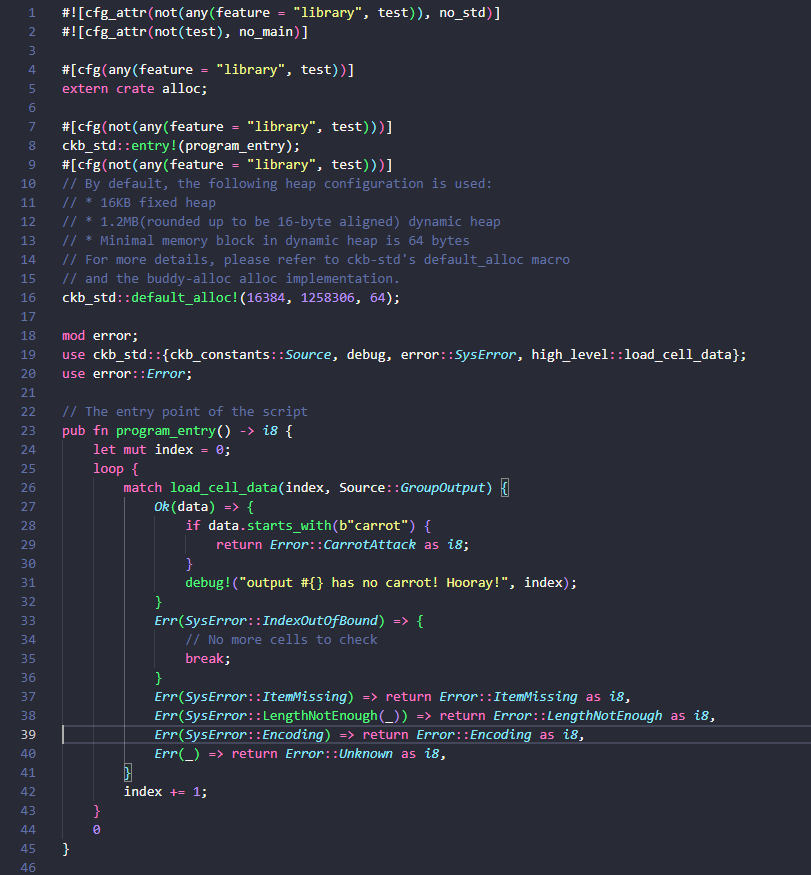
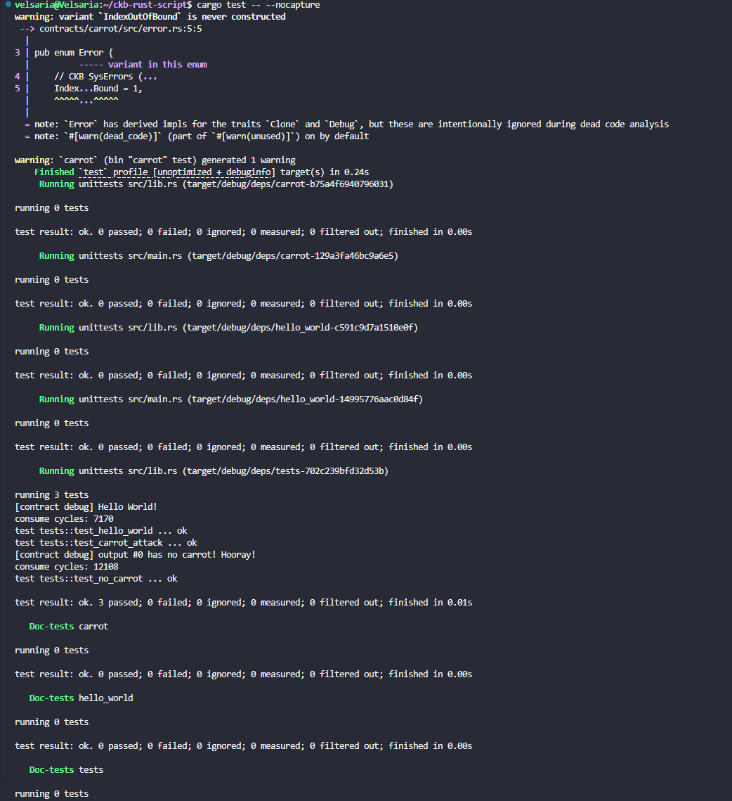

# Builder Track Weekly Report — Week 5

**Name:** Wildan Rahman
**Week Ending:** September 6, 2026

### Courses Completed

- Start of the intermediate material: Script development in Rust, [Quick Start](https://docs.nervos.org/docs/script/rust/rust-quick-start) (hello-world) and [Example: A Minimal Script](https://docs.nervos.org/docs/script/rust/rust-example-minimal-script) (the carrot script), both with `ckb-script-templates`, `ckb-debugger` and `ckb-testtool`
- Re-read [Intro to Script](https://docs.nervos.org/docs/script/intro-to-script), this time for the execution rule rather than the concepts
- Xuejie Xiao's [Introduction to CKB Script Programming 1: Validation Model](https://xuejie.space/2019_07_05_introduction_to_ckb_script_programming_validation_model/), plus a skim of the rest of that series. Worth flagging for anyone following the same path: the series is from 2019–2020 and parts of it are dead (Duktape, the Ruby SDK). The model discussion in post 1 is still the clearest explanation I have found anywhere.
- Went back to the xUDT script source now that I can read a Rust script, looking for the conservation check I guessed at in the week 3 report

### Key Learnings

- The cost difference between a Rust script and a JS one is not subtle. My carrot type script verifies at **12,108 cycles**. Last week's JS hash lock cost **13,086,956**. That is roughly 1,080x, and the two are doing comparable work: a syscall into the transaction, load some bytes, compare them. The bare hello-world is 7,170 cycles, but I would not quote that one as the comparison since it only prints. The interpreter is the cost, not the logic.
- Seeing the actual build command taught me more than the tutorial text did. The Makefile compiles to `riscv64imac-unknown-none-elf` with `RUSTFLAGS="-C target-feature=+zba,+zbb,+zbc,+zbs -C passes=lower-atomic"` and `TARGET_CC=clang`. So: 64-bit RISC-V with multiply, atomics and compressed instructions, the bit-manipulation extensions turned on, no operating system underneath, and atomics lowered to plain instructions because there is no concurrency inside a script for them to protect against. Last week I shipped QuickJS bytecode to an interpreter. This week I am shipping a freestanding ELF binary.
- A script brings its own heap. The template header has `default_alloc!(16384, 1258306, 64)`, a 16KB fixed heap plus a ~1.2MB dynamic one on a buddy allocator. That is not decoration. It is what makes `high_level::load_cell_data` able to hand back a `Vec`.
- **Output Cells' Lock Scripts are never executed.** Only input locks, input types and output types run. This is the answer to a question I did not know I had: why two script types at all? A rule about what outputs are allowed to contain simply cannot live in a lock, because nothing would ever run it. Carrot has to be a type script. Week 4's hash lock had to be a lock. That is the whole distinction.
- The `Group` in `Source::GroupOutput` is doing real work. My test transaction has two output cells, but the script only printed once, for output #0. A script only sees the cells carrying *that same script*. The plain change cell holding `tomato` is invisible to carrot, and correctly so, because carrot is not guarding it.
- Error codes 1 to 4 are reserved by CKB (`IndexOutOfBound`, `ItemMissing`, `LengthNotEnough`, `Encoding`), so custom errors start at 5. `CarrotAttack` is 5, and the test asserts on exactly that. Worth noticing that `IndexOutOfBound` is never actually returned as a failure. Running off the end of the outputs is how the script knows it is finished, so it breaks and returns 0. The compiler even warns that the variant is never constructed, which is a fair description of what happened.
- On xUDT and the validation model: the type script is where conservation is enforced, which is what I had assumed in week 3 when my overspend was rejected client-side before it ever reached the chain. The pattern is the same one carrot uses, sum the group instead of scanning for a prefix. Xuejie's framing that stuck with me is that a transaction is a proposed transformation from one set of cells to another, and scripts exist to judge the transformation rather than to perform it. That is the same "verify, don't execute" line from my week 1 report, but I understand it differently now that I have written the judging code.

### Practical Progress

- Set up the Rust toolchain in WSL for the first time in this program (weeks 1 to 4 were all TypeScript): rustup, the `riscv64imac-unknown-none-elf` target, `cargo-generate`, and `ckb-debugger`.
- The `ckb-debugger` install failed twice before it worked. First, `cargo install --locked --git <repo>` without a package name: the repo is a workspace with three binaries, so cargo refused with `multiple packages with binaries found: ckb-debugger, ckb-vm-pprof, ckb-vm-pprof-converter`. Adding `ckb-debugger` to the end of the command fixed it. Then the build died in `protobuf-ckb-syscalls v1.1.1` with `Could not find protoc`. The docs mention protoc only under a macOS note, but Ubuntu needs it too. `apt-get install protobuf-compiler` and a rebuild got me there. Slightly annoying that a profiler subcomponent is what drags protobuf into a tool I only wanted for running a script offline.
- Then `make build` failed too: `ckb-std v1.1.0` panicked with `Clang compiler not found. Error CLANG environment:`. Its build script compiles `c/dlopen.c` and `c/libc.c` for the RISC-V target, so a C compiler is not optional. Installed clang/llvm 18.1.3 and it built.
- Generated the workspace with `ckb-script-templates`, then `make generate CRATE=hello-world`, dropped a `debug!` into `program_entry`, and ran it: `Run result: 0`, `All cycles: 7170 (7.0K)`.
- Wrote the carrot script, a type script that walks every output cell in its group and rejects any whose data starts with `carrot`. My first version did not compile, four errors, and all four were me writing against an older `ckb-std` API than the 1.1 I actually have:
  - `Source` is in `ckb_std::ckb_constants`, not `high_level`. The error message says the enum is "private", which is confusing until you see that `high_level` does `use crate::ckb_constants::*` internally. That is a private import, not a re-export.
  - `load_cell_data` exists in two places and I had them crossed. `high_level::load_cell_data(index, source)` takes two arguments and returns an owned `Vec<u8>`. The three-argument version that fills a buffer you supply and returns a size is the raw syscall in `ckb_std::syscalls`. This is the distinction I am most glad I hit, because the low-level one never touches the heap while the high-level one allocates, and in a place where every allocation costs cycles that is a decision and not a style preference. My buffer version was also a latent bug: a fixed 256 bytes would have started failing on any cell with more data than that.
  - `SysError::LengthNotEnough` is a tuple variant carrying the length that was actually required, so it has to be matched as `LengthNotEnough(_)`.
  - `&data[..size]` no longer means anything once you are handed a `Vec`.
- The unit test that `make generate` writes for you attaches the new script as a **lock** script. For carrot that test is worthless: it passes, but only because a lock script's `GroupOutput` is empty, so the loop breaks on the first iteration having checked nothing. Replaced it with two tests that attach carrot as a type script on an output cell, with always-success as the lock so the only thing under test is carrot: `test_no_carrot` (outputs `apple` and `tomato`, expected to verify) and `test_carrot_attack` (outputs `carrot` and `tomato`, expected to fail with error code 5).
- One more compile error on the way, `E0521 borrowed data escapes outside of function`, from passing a `&str` into `Bytes::from` inside a helper. `Bytes::from(&str)` borrows and wants `'static`; copying the bytes with `.as_bytes().to_vec()` was the fix.
- All three tests green: hello-world at 7,170 cycles, `test_no_carrot` at 12,108, and `test_carrot_attack` rejected with code 5.

**Evidence:**

### Environment

- Windows 11 + WSL2 Ubuntu 24.04, Rust 1.98.1 with the `riscv64imac-unknown-none-elf` target
- clang 18.1.3, protoc 3.21.12, ckb-debugger 1.1.1, ckb-std 1.1, ckb-testtool 1.1.1
- Workspace generated by `ckb-script-templates` at `~/ckb-rust-script`
- No devnet this week. Everything ran off-chain in ckb-debugger and ckb-testtool, which is a noticeably faster loop than weeks 2 to 4.

### Plan for Next Week

- Deploy the carrot script to devnet and drive it with a real transaction. The tutorial stops at unit tests and says deployment is coming "in another tutorial soon", so this is on me to work out from the week 4 deploy flow.
- The sUDT/xUDT standard properly, rather than only reading the source for one check.
- Nervos DAO, since it is the canonical example of economics implemented purely as a type script.
