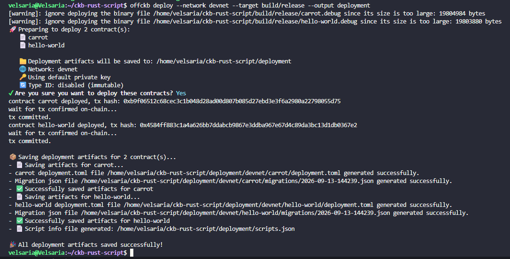
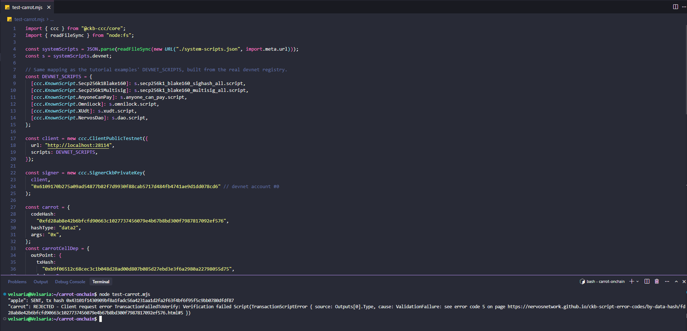
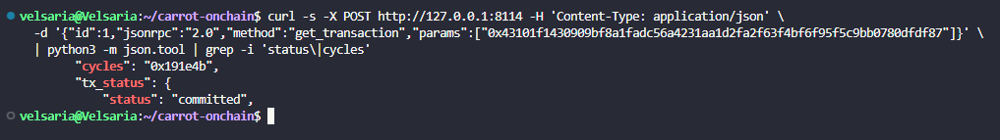
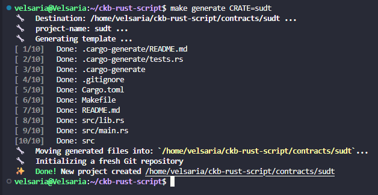
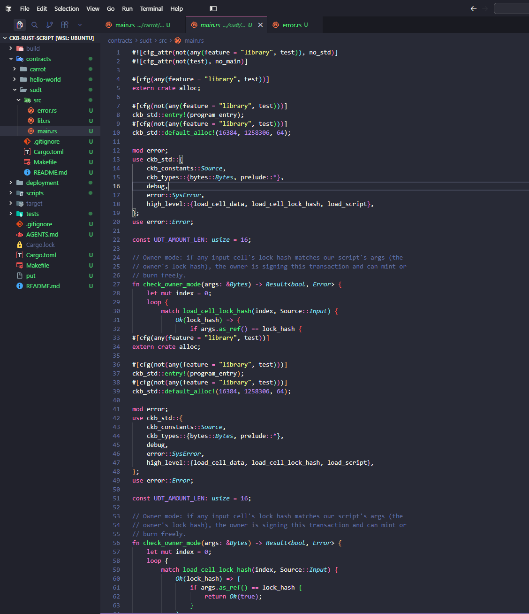
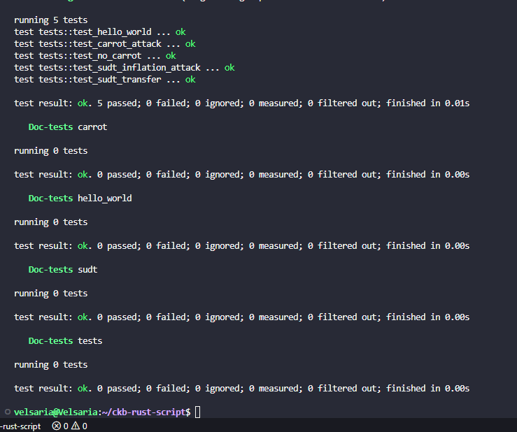

# Builder Track Weekly Report — Week 6

**Name:** Wildan Rahman
**Week Ending:** September 13, 2026

### Courses Completed

- Closed out week 5's leftover item: deployed carrot to devnet and drove it with a real transaction (it had only ever run inside `ckb-testtool` before)
- [Example: Simple UDT (Rust)](https://docs.nervos.org/docs/script/rust/rust-example-sudt-script) — wrote an sUDT token script from scratch using the same `ckb-script-templates` flow as carrot

### Key Learnings

- `ckb-testtool` and a real devnet are two different worlds. Carrot's unit tests used an always-success lock and never touched a real client, so nothing about fees, cellDeps, or genesis registries was exercised. Building a real transaction against my own devnet surfaced problems the tests couldn't have caught.
- A `Script` object needs `args` even when there's nothing meaningful to put there — leaving it out isn't the same as `"0x"`, it's `undefined`, and CCC's serializer has no default for that. Small thing, cost me a full crash before I noticed.
- The bigger one: `ClientPublicTestnet` ships with a hardcoded script registry for the real testnet. Passing a custom `scripts` object doesn't merge with that registry, it **replaces it entirely**. I only overrode the secp256k1 entry, so the moment CCC's input-collection logic went looking for `AnyoneCanPay` (which it apparently probes regardless of whether you use it), it found nothing and errored. Devnet examples fix this by building the *complete* registry from the local `system-scripts.json` up front, not by patching in one entry at a time.
- Once both of those were fixed, carrot rejected the `"carrot"` output with the same error code 5 from its own unit tests — except this time a real node validated it, and the successful transaction actually committed on-chain with a real cycle count I could pull over RPC.
- sUDT's rule is exactly the conservation check I read in xUDT's source back in week 5, now written by hand: sum the group's input amounts, sum the group's output amounts, reject if outputs exceed inputs. The one new idea is owner mode — checking whether any input cell's lock hash matches the script's own args, and if so skipping the check entirely so the owner can mint or burn. Carrot had no equivalent concept; every rule it enforced applied unconditionally.
- Cycle costs, lined up: hello-world 7,170 → carrot 12,108 → sUDT 27,218 (in `ckb-testtool`, an always-success lock, no real signature). But carrot's real on-chain transaction cost 1,646,155 cycles — about 135x its isolated test number, because verifying the secp256k1 signature on the input completely dominates the cost of the type script check. The unit test numbers measure the script; they don't measure the transaction.
- I made the same mistake twice in one session and had to be told to actually verify my own code before handing it over — a good reminder that "it looks right" and "it runs" are different claims, especially once devnet-specific config is involved.

### Practical Progress

- Deployed carrot to devnet (`offckb deploy --target build/release`) alongside hello-world; got real OutPoints for both.
- Wrote a small standalone Node script with `@ckb-ccc/core` to attach carrot as a type script on real output cells — no frontend needed, just the client directly.
- Hit two real errors getting that script working:
  1. `TypeError: undefined is not iterable` deep inside CCC's serializer — traced to a missing `args: "0x"` on the type script object.
  2. `TransactionFailedToResolve: Unknown(OutPoint(...))` on the genesis secp256k1 dep group — traced to the client silently falling back to real-testnet's script registry, fixed by loading my devnet's actual `system-scripts.json` and building the full `DEVNET_SCRIPTS` map from it, the same pattern the tutorial examples use.
- With both fixed: `"apple"` sent for real, `"carrot"` rejected with error code 5, transaction committed on-chain at 1,646,155 cycles.
- Generated an sUDT contract in the same workspace as carrot (`make generate CRATE=sudt`), wrote `check_owner_mode` (scans input lock hashes against script args) and `collect_amount` (sums a cell group's `u128` data), and the conservation check itself.
- Replaced the auto-generated placeholder test with two real ones: a 400→300+100 transfer that should pass, and a 400→300+200 attempt that should be rejected with error code 5. Both pass; `make test` is clean across all three contracts.
- Didn't get to Nervos DAO this week — ran out of time after Sessions A and B. Read the topic list but nothing to show for it yet.

**Evidence:**

### Environment

- Windows 11 + WSL2 Ubuntu, Rust 1.98.1, `riscv64imac-unknown-none-elf` target, ckb-std 1.1
- `@ckb-ccc/core` ^1.5.3 in a small standalone Node script (no frontend) for driving carrot on-chain
- Same `~/ckb-rust-script` cargo workspace as week 5, now with carrot + hello-world + sudt as members

### Plan for Next Week

- Nervos DAO: RFC 0023, the "Nervos DAO Explained" writeup, and the `dao.c` source — it's the first script needing block headers, not just transaction cells, so I want to actually understand that before moving on
- If time allows, a real deposit transaction on devnet using the DAO system script directly
