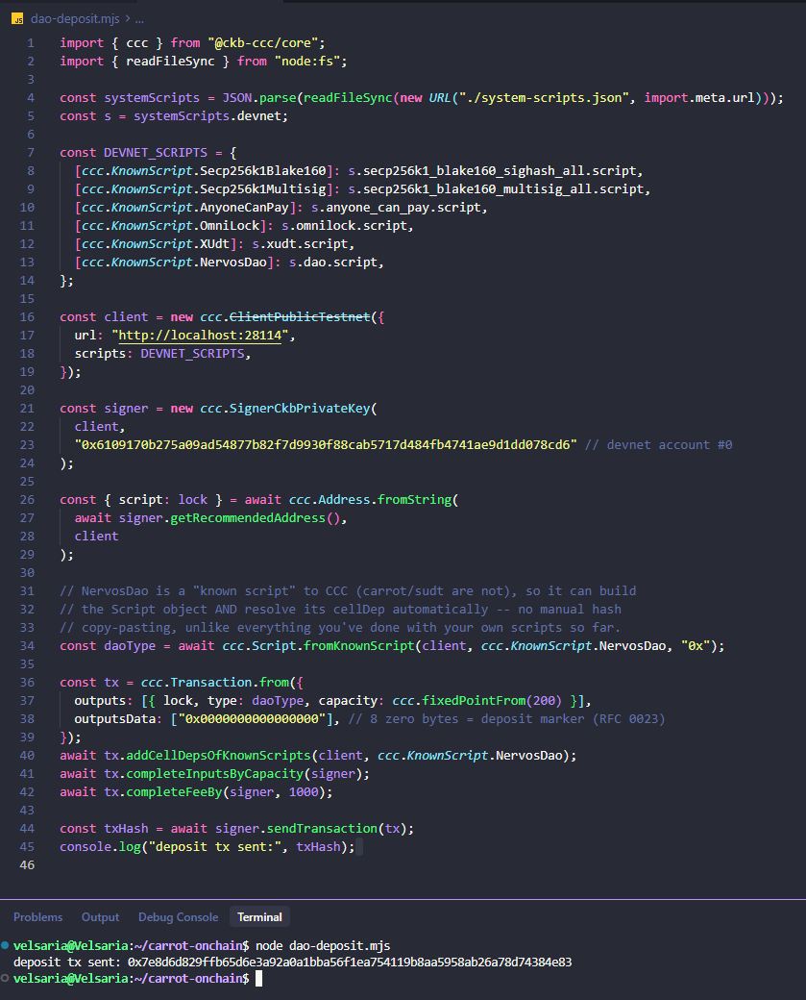
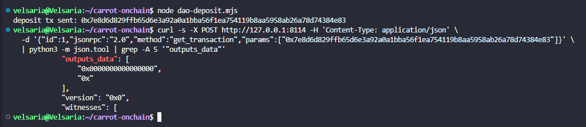

# Builder Track Weekly Report — Week 7

**Name:** Wildan Rahman
**Week Ending:** September 20, 2026

### Courses Completed

- [RFC 0023 — Deposit and Withdraw in Nervos DAO](https://github.com/nervosnetwork/rfcs/blob/master/rfcs/0023-dao-deposit-withdraw/0023-dao-deposit-withdraw.md)
- [Nervos DAO Explained (Medium)](https://medium.com/nervosnetwork/nervos-dao-explained-95e33898b1c)
- [dao.c source](https://github.com/nervosnetwork/ckb-system-scripts/blob/master/c/dao.c) — the actual type script implementing all of the above
- A real deposit transaction on my own devnet, built by hand with CCC

### Key Learnings

- Nervos DAO exists to answer one problem: CKB has secondary issuance (new CKB minted over time to fund state storage), which dilutes everyone who just holds it. DAO lets you lock CKB and get a proportional share of that issuance back as compensation instead of being diluted by it. It's an inflation hedge implemented entirely as a type script, not a protocol-level feature.
- Withdrawal is two separate transactions, not one, and the reason is timing. A withdrawal *request* consumes the deposit cell and creates a new cell with the same DAO type script, but the data field changes from 8 zero bytes to the 8-byte deposit block number — that's how the script tells a fresh deposit apart from a pending withdrawal. Only after that request has sat through a minimum lock period can a second, *final* withdrawal transaction actually release the funds plus compensation. Deposits lock in fixed 180-epoch cycles for compensation purposes — CCC's own client library literally has a named constant for this, "one Nervos DAO cycle" — so you can't withdraw early and still collect a partial cycle's compensation; you either complete the cycle or don't.
- The compensation math is a ratio, not a fixed rate. Every block header carries an "AR" (accumulated rate) value. Compensation on withdrawal is `capacity × (AR at withdrawal ÷ AR at deposit) − capacity`. That's why the type script needs the *headers* from both the deposit block and the withdrawal block, not just the transaction it's currently verifying — the AR values live in header data, not in any cell. This is the concrete answer to something I only had a vague sense of after skimming `dao.c`'s header calls: every other script I've written (carrot, sUDT) only ever looks at the current transaction's cells. DAO has to look backward at chain history to know what a deposit is actually worth.
- Practically, this means DAO cells carry state that only makes sense in the context of *when* they were created, not just what they contain. A cell's data alone (8 zero bytes, or a block number) is meaningless without the header it's paired with — the type script's whole job is reconciling "what does this cell claim" against "what actually happened on chain at that point."
- Building the deposit itself turned out to be the easiest transaction I've built all program, and for a specific reason: unlike carrot or sUDT, CCC already knows what NervosDao is. It's a "known script" — `Script.fromKnownScript(client, KnownScript.NervosDao, args)` builds the correct type script object directly, and `addCellDepsOfKnownScripts` resolves its cellDep automatically. No manually copying a code hash and outPoint out of a JSON file, which is exactly what carrot and sUDT required every time because CCC has never heard of my own scripts.
- Before any of that worked, I had to reset my devnet. It had been running continuously since week 1, and its on-disk genesis had drifted out of sync with what the currently installed `offckb` actually reports as the devnet's genesis layout — a system script's cellDep outPoint that both `offckb system-scripts` and my own cached config agreed on still failed to resolve on the old chain. `offckb clean` followed by a fresh `offckb node` fixed it immediately. Good reminder that devnet state is disposable by design and shouldn't be trusted to stay consistent indefinitely, especially across many weeks of a long-running program like this one.

### Practical Progress

- Wrote `dao-deposit.mjs`: builds a transaction with the NervosDao type script on an output cell, capacity 200 CKB, data set to 8 zero bytes (the deposit marker per RFC 0023).
- Sent it on the first real attempt after the devnet reset — no errors. Tx hash `0x7e8d6d829ffb65d6e3a92a0a1bba56f1ea754119b8aa5958ab26a78d74384e83`.
- Verified on-chain via RPC: `outputs_data` shows `["0x0000000000000000", "0x"]` — the deposit cell's zero-byte marker, plus an empty-data change cell.
- Didn't attempt a withdrawal request or final withdrawal. Doing that meaningfully needs real epoch progression on the order of a full DAO cycle, which isn't something a week can produce honestly — noting it as understood, not built.

**Evidence:**

### Environment

- Same as recent weeks: Windows 11 + WSL2 Ubuntu, `@ckb-ccc/core` ^1.5.3, `~/carrot-onchain` project reused from week 6
- Devnet reset this week (`offckb clean` + fresh `offckb node`) after the genesis drift described above

### Plan for Next Week

- Spore Protocol / DOBs — the last item on the intermediate list before moving into advanced material
- Revisit the capstone: RetricSu confirmed the devnet explorer direction is genuinely not duplicated, waiting on his read of the corrected scope before locking anything in
