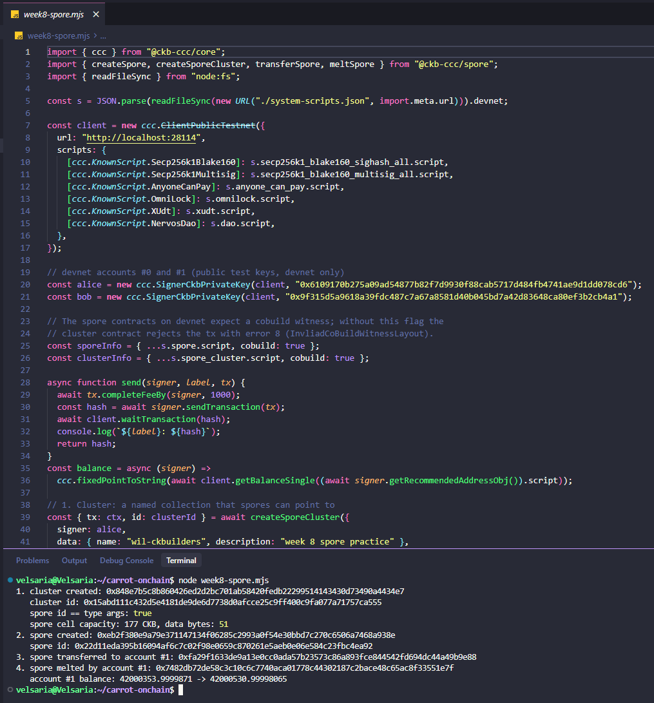
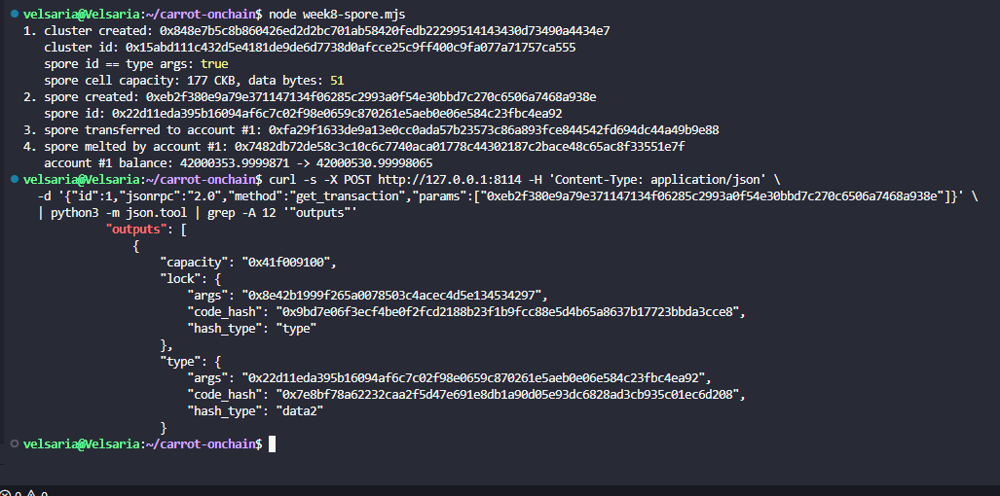

# Builder Track Weekly Report — Week 8

**Name:** Wildan Rahman
**Week Ending:** September 27, 2026

### Courses Completed

- [Spore docs](https://docs.spore.pro/) intro, and the [DOB/0 protocol](https://docs.spore.pro/dob/dob0-protocol) page
- Skimmed the [DOB cookbook](https://github.com/sporeprotocol/dob-cookbook)
- Full spore lifecycle on devnet with `@ckb-ccc/spore`: create cluster, create spore, transfer, melt

### Key Learnings

- A spore is just a cell with the spore type script on it. The content lives in the cell's data, and the spore id is the type script's args. Same pattern as xUDT in week 3, where the args were the token's identity. The script prints `spore id == type args: true` to confirm it.
- A cluster is a separate cell that acts as a named collection. Spores can point to it through a `clusterId` field in their data.
- DOB/0 builds on top of this. The spore's content is a "DNA" hex string, the cluster's description holds a "pattern", and a decoder reads byte ranges of the DNA to produce traits (numbers from a range, options from a list, utf8 strings). So the trait logic lives off-chain in the decoder, and the chain only stores the raw DNA.
- The recipe pages on docs.spore.pro still use `@spore-sdk/core`, which is built on Lumos. The handbook says to skip Lumos, so I used CCC's spore package instead (`createSporeCluster`, `createSpore`, `transferSpore`, `meltSpore`).
- The spore contracts on devnet need a cobuild witness. CCC only adds it if the script info has `cobuild: true`. Without it, the cluster contract rejects the transaction with error code 8, which the spore-contract source names `InvliadCoBuildWitnessLayout` (typo is theirs).
- The spore cell cost exactly 177 CKB, and the numbers add up: 8 (capacity) + 53 (lock) + 65 (type: 32 code hash + 1 hash type + 32 spore id) + 51 (data). The 51 data bytes are the molecule-encoded spore data: a 16-byte header, then `text/plain` (4-byte length + 10), then `hello from week 8` (4-byte length + 17), then an empty cluster id.
- Melting is the "melt to reclaim" idea from the DOB exercise in week 3, done by hand this time. The owner consumes the spore cell without creating a new one and gets the capacity back. Only the current owner can do it. After the transfer that was account #1, not the account that created it.
- One gap on devnet: putting a spore inside a cluster doesn't work with the current CCC package. `createSpore` looks up the cluster using CCC's built-in testnet/mainnet script locations, and there's no parameter to point it at devnet, so it fails with "Cluster ... not found". Standalone spores and clusters both work fine. Another small example of tooling that assumes testnet/mainnet, which is the same kind of gap my capstone idea is about.

### Practical Progress

- Ran `week8-spore.mjs` on devnet:
  1. Cluster created: `0x848e7b5c8b860426ed2d2bc701ab58420fedb22299514143430d73490a4434e7`
  2. Spore created: `0xeb2f380e9a79e371147134f06285c2993a0f54e30bbd7c270c6506a7468a938e` (177 CKB, 51 data bytes)
  3. Transferred to devnet account #1: `0xfa29f1633de9a13e0cc0ada57b23573c86a893fce844542fd694dc44a49b9e88`
  4. Melted by account #1: `0x7482db72de58c3c10c6c7740aca01778c44302187c2bace48c65ac8f33551e7f`. Account #1's balance went up by 176.99999355 CKB, which is the 177 CKB back minus the fee. (Its starting balance was already above 42,000,000 because earlier test runs of the same script had sent it melted spores too.)
- Pulled the spore creation tx over RPC: capacity `0x41f009100` (177 CKB), type script code hash `0x7e8bf78a...` with `data2`, and the type args equal to the spore id printed by the script.

**Evidence:**

### Environment

- Windows 11 + WSL2 Ubuntu, `~/carrot-onchain` project reused
- Added `@ckb-ccc/spore` 1.6.14 (installing it also bumped `@ckb-ccc/core`)
- Spore and cluster script info taken from the devnet `system-scripts.json`, with `cobuild: true`

### Plan for Next Week

- Intermediate material is done. The program ends around early November, so October goes to the capstone.
- Lock the scope of the OffCKB devnet explorer with RetricSu and start building the core: reading blocks/transactions from the devnet RPC, and resolving script code hashes to names from `system-scripts.json` and the project's own `deployment/scripts.json`.
