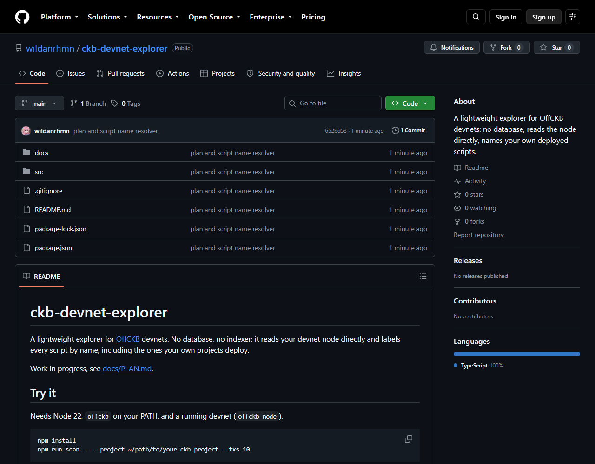
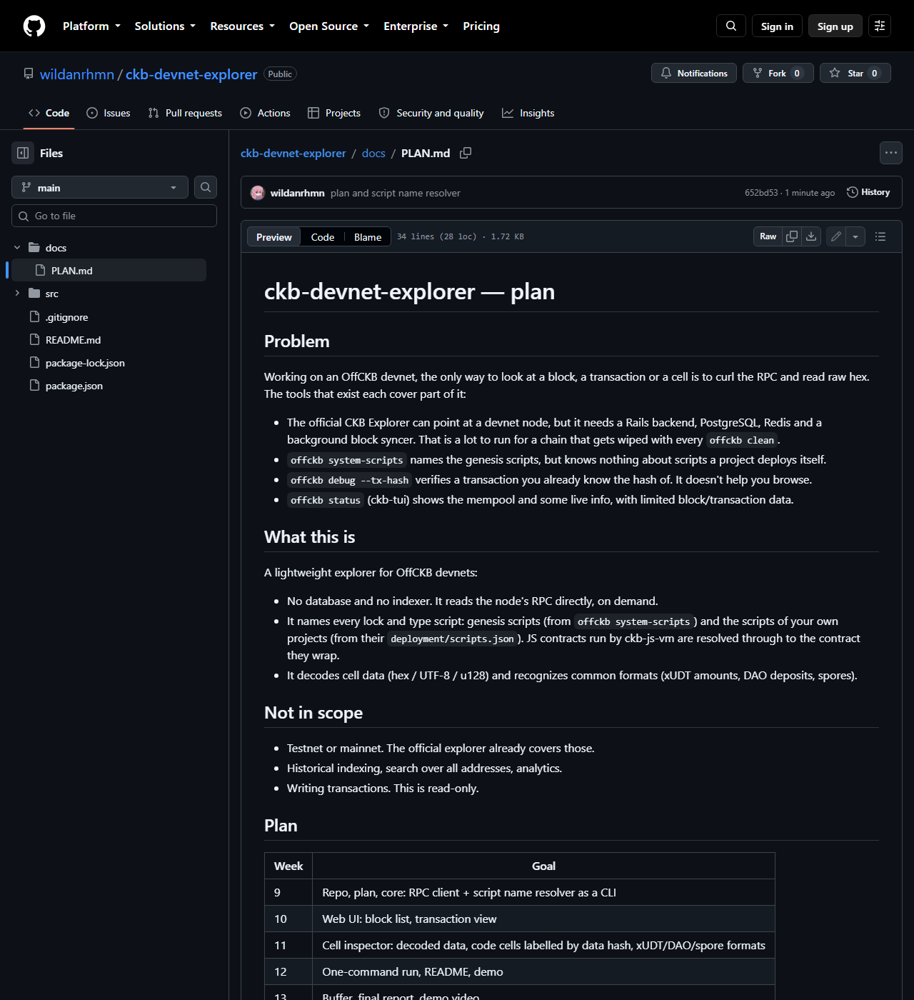
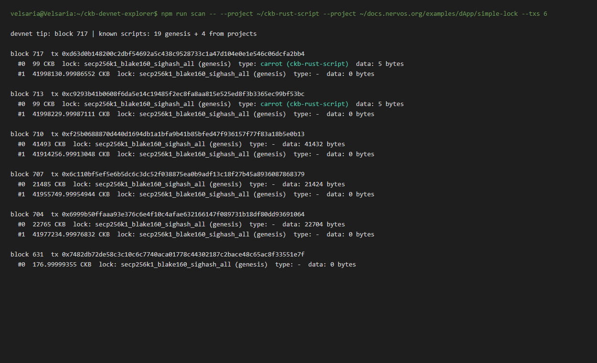

# Builder Track Weekly Report — Week 9

**Name:** Wildan Rahman
**Week Ending:** October 4, 2026

### Courses Completed

- Capstone kickoff. Neon approved building the devnet explorer as a standalone tool (RetricSu hasn't replied to the refined scope, so I'm not blocking on offckb integration).
- New repo: [ckb-devnet-explorer](https://github.com/wildanrhmn/ckb-devnet-explorer), with a written plan in [docs/PLAN.md](https://github.com/wildanrhmn/ckb-devnet-explorer/blob/main/docs/PLAN.md)
- First working piece: a CLI that reads the devnet directly and labels every lock and type script by name

### Key Learnings

- The key for naming a script is just its code hash plus hash type. Every cell's lock and type carry both, and the same pair shows up in offckb's system scripts and in a project's `deployment/scripts.json`. So naming a script is a map lookup, no chain query needed.
- `offckb system-scripts -o file.json` writes the devnet's genesis scripts as JSON, same shape as the `system-scripts.json` files I've been reading since week 2. The explorer asks offckb for this every run instead of keeping a copy, because in week 7 a cached copy went out of sync with the actual chain and cost me a devnet reset.
- A project's own scripts live in `deployment/scripts.json` after `offckb deploy`. That file is the thing none of the existing tools read, and it's what lets the explorer say `carrot (ckb-rust-script)` instead of an unknown hash.
- JS contracts need one extra step. Their lock or type points at ckb-js-vm, and the real contract's code hash sits in the args after 2 flag bytes, with the hash type byte right after it. That's the layout from the simple lock in week 4, so the resolver looks through ckb-js-vm to the contract inside.
- Reading the chain doesn't need CCC at all. Plain JSON-RPC (`get_tip_block_number`, `get_block_by_number`) with `fetch` is enough, which keeps the tool small. CCC will come back in for decoding.
- Things I ran into while setting up:
  - The `offckb clean` from week 7 had wiped my carrot deployment, so I redeployed carrot, hello-world and sUDT (sUDT's first time on-chain).
  - `test-carrot.mjs` had carrot's old outPoint hardcoded and broke after the redeploy. It now reads the outPoint from `deployment/scripts.json`.
  - The `C:/Program: No such file` error I saw from `offckb --help` in week 7 wasn't offckb at all. The Windows PATH was leaking into WSL, and a clean PATH fixes it.
- Next obvious feature: deployed contract cells show up as plain data right now (`data: 22704 bytes`). For `data`/`data1`/`data2` scripts the code hash is the hash of that data, so the explorer can hash a cell's data and label it "code cell: carrot".

### Practical Progress

- Wrote `docs/PLAN.md`: the problem, what exists today and where each falls short, scope, what's out of scope, and a week-by-week plan to the end of the program.
- Built the core in TypeScript (`src/rpc.ts`, `src/scripts.ts`, `src/resolver.ts`, `src/cli.ts`): connects to `127.0.0.1:8114`, loads 19 genesis scripts from offckb plus 4 from my projects, walks back from the tip and prints every output cell with its lock, type, capacity and data size.
- Redeployed carrot (tx `0x6999b50ffaaa93e376c6e4f10c4afae632166147f089731b18df80dd93691064`) plus hello-world and sUDT, then sent a carrot transaction. The scan labels it `type: carrot (ckb-rust-script)` next to the `(genesis)` scripts, and also picks up the spore and cluster cells from week 8.

**Evidence:**

### Environment

- Windows 11 + WSL2 Ubuntu, Node 22, offckb 0.4.11
- TypeScript run with `tsx`, no other runtime dependencies yet
- Projects scanned: `~/ckb-rust-script` (carrot, hello-world, sUDT) and the simple-lock example

### Plan for Next Week

- Web UI: a small Node server that serves a page and the script names, with a block list and a transaction view in the browser
- Start on code-cell labelling by data hash
